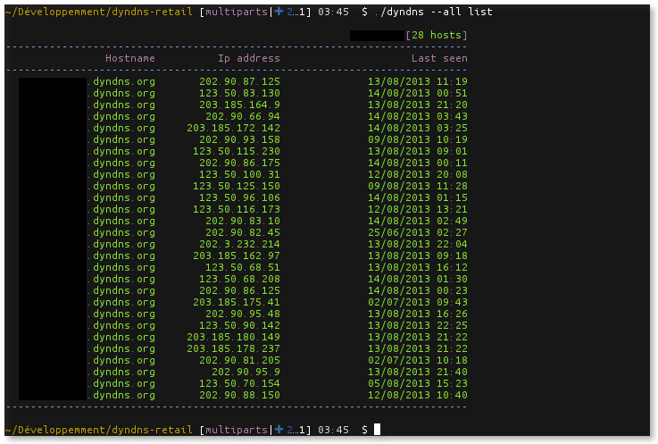

# Dyndns

Ce script permet de gérer l'ensemble de vos comptes dyndns. Il permet de lister les hôtes de plusieurs comptes, de tester les connexions à vos comptes dyndns et, accessoirement, de mettre à jour votre nom d'hôte avec votre adresse IP dynamique.



## Pré-requis
Ce projet utilise le module python mechanize. Sur une Debian, on l'installe de cette manière :
```bash
apt-get install python-mechanize
apt-get install python-beautifulsoup
```

## Paramétrage
La configuration se fait dans deux fichiers de configuration :

- dyndns.cfg : fichier de configuration principal
- account : fichier de configuration des comptes.

Pour ce dernier, il est possible d'activer l'option gpg_enable dans le fichier de configuration principal. Celui-ci permet d'utiliser un fichier de compte chiffré. Pour obtenir un tel fichier veuillez vous reférez à la section "Sécurisation" plus bas.

## Utilisation

Les options disponibles :
```bash
$ ./dyndns
usage: dyndns.py [-h] [--all] [--debug] {connect,list,update} ...

Manage your Dyndns Account.

positional arguments:
  {connect,list,update}
                        sub-command help
    connect             connect hostnames
    list                listing hostnames
    update              update hostnames

optional arguments:
  -h, --help            show this help message and exit
  --all                 Options for all account
  --debug               Debug mode
```
Pour tester la validité d'un login/mot de passe :
```bash
./dyndns --all connect
./dyndns connect -u USER -p PASSWORD
```
Pour lister les différentes machines d'un compte (ou de tout vos comptes):
```bash
./dyndns --all list
./dyndns list -u USER -p PASSWORD
```
Pour mettre à jour un nom d'hôte :
```bash
./dyndns update -u USER -p PASSWORD -H example.dyndns.org
```

## Sécurisation
Avant d'aller plus loin, assurez vous d'avoir installé GnuPG. Suivant la distribution que vous utilisez, l'installation de ce logiciel sera plus au moins simplifiée.

Pour activer la sécurisation du fichier contenant vos comptes dyndns, il faut tout d'abord configurer les comptes dans le fichier account "non chiffré". Une fois les comptes configurés, veuillez lancer la commande suivante pour y ajouter une passphrase.
```
gpg --symmetric account
```
Pour l'utilisation des clefs (donc sans mot de passe), utilisez plutôt la commande suivante :
```
gpg -e account -r VOTRE_CLEF
```
N'oubliez pas de supprimer le fichier "account", une fois votre fichier account.gpg généré (celui-ci n'étant pas chiffré...).

## License

Copyright (c) 2011-2013, Farahei14
All rights reserved.

Redistribution and use in source and binary forms, with or without 
modification, are permitted provided that the following conditions are met:

Redistributions of source code must retain the above copyright notice, this 
list of conditions and the following disclaimer.
Redistributions in binary form must reproduce the above copyright notice, this 
list of conditions and the following disclaimer in the documentation and/or 
other materials provided with the distribution.

THIS SOFTWARE IS PROVIDED BY THE COPYRIGHT HOLDERS AND CONTRIBUTORS "AS IS" AND 
ANY EXPRESS OR IMPLIED WARRANTIES, INCLUDING, BUT NOT LIMITED TO, THE IMPLIED 
WARRANTIES OF MERCHANTABILITY AND FITNESS FOR A PARTICULAR PURPOSE ARE 
DISCLAIMED. IN NO EVENT SHALL THE COPYRIGHT HOLDER OR CONTRIBUTORS BE LIABLE 
FOR ANY DIRECT, INDIRECT, INCIDENTAL, SPECIAL, EXEMPLARY, OR CONSEQUENTIAL 
DAMAGES (INCLUDING, BUT NOT LIMITED TO, PROCUREMENT OF SUBSTITUTE GOODS OR 
SERVICES; LOSS OF USE, DATA, OR PROFITS; OR BUSINESS INTERRUPTION) HOWEVER 
CAUSED AND ON ANY THEORY OF LIABILITY, WHETHER IN CONTRACT, STRICT LIABILITY, 
OR TORT (INCLUDING NEGLIGENCE OR OTHERWISE) ARISING IN ANY WAY OUT OF THE USE 
OF THIS SOFTWARE, EVEN IF ADVISED OF THE POSSIBILITY OF SUCH DAMAGE.
